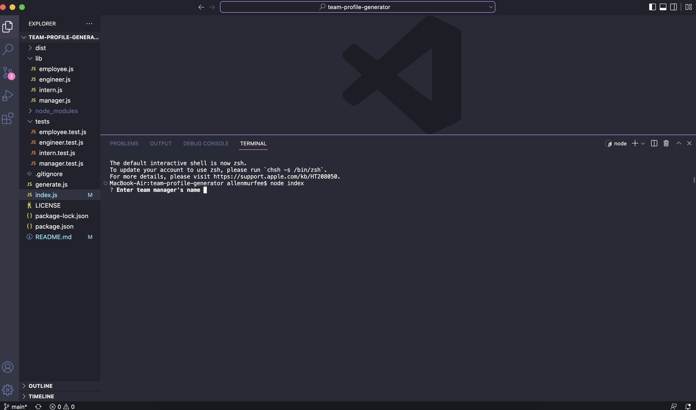

# Team Profile Generator

## Description

This project is a team profile generator that assembles cards on a webpage containing team member info. Each team has a manager, and after that you can add as many engineers and interns as you'd like. The motivation behind this project came from the desire for an easy way to dynamically create a team with contact info, without having to base it on a number of members. This way, it's easy to enter each team member's information without having to build a site.

Throughout this project, I learned a lot about testing using Jest and OOP. After this project, I can see the benefit of OOP and languages built around them, as it's an effective way of accessing data.

## Installation

To install this project, please download the GitHub repository.

## Usage

After installing the GitHub repository, right click on the "index.js" file in VS Code (or whatever program you're using) and open it in the integrated terminal. Type in "node index" and the terminal will begin the process.

Additionally, here is a tutorial video to demonstrate how the application works.

## Credits

AskBCS for helping with testing questions.

## License

MIT License
